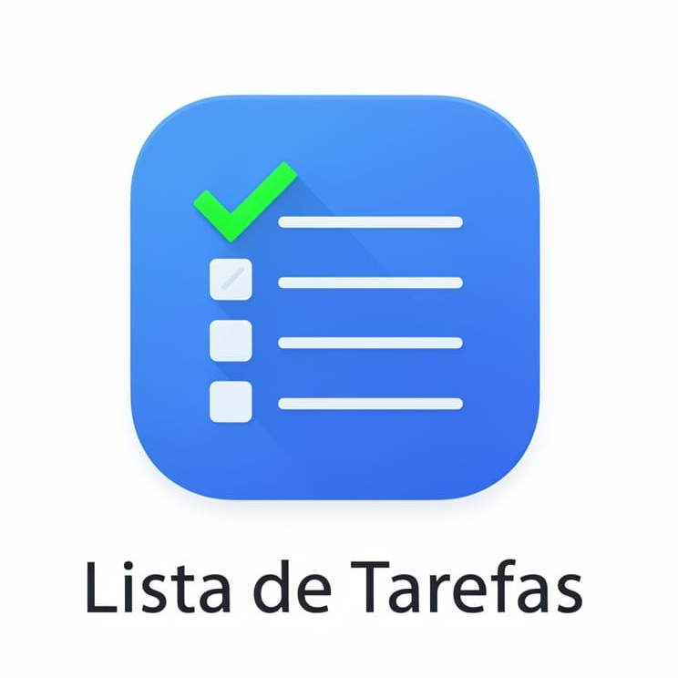

    

# Letícia Cruz 🪐

  <strong><code>desenvolvimento de software</code></strong> •
  <strong><code>back-end</code></strong> •  
  <strong><code>cibersegurança</code></strong>

Olá! Me chamo Letícia Cruz. Sou estudante de desenvolvimento de software, com foco em **back-end** e resolução de problemas utilizando **Java** e **Spring Boot**. Tenho maior afinidade com a construção de lógica, estruturação de sistemas e modelagem de aplicações, mas também possuo noções de **front-end**, que aplico na criação de interfaces web e desktop simples (HTML, CSS e React.js), buscando agregar _interatividade_ e melhor _experiência_ aos meus projetos.

Adicionalmente, estudo **cibersegurança** com o intuito de entender mais sobre _vulnerabildades_ e aplicar _princípios de segurança_ no desenvolvimento de aplicações.

#### 🎓 Formação Acadêmica

-  <strong> Bacharel em Ciência da Computação </strong>  
  <samp> Universidade Estadual da Paraíba (UEPB) | 2024 - atualmente </samp>

-  <strong> Curso Técnico em Informática</strong>  
  <samp> Instituto Federal de Educação, Ciência e Tecnologia da Paraíba (IFPB) | 2020 – 2023 </samp>

## Linguagens e Tecnologias

**\<\/back-end**>

ㅤㅤ

**\<\/outros**>

ㅤㅤ

## No Momento

### Desenvolvendo

**Datalogger** - Expansão do dispositivo eletrônico para conter back-end Spring Boot + front-end React.

**Live chat** - explorar protocolo STOMP, configurações do WebScoket no Spring Boot e canal de mensagens persistente.

### Estudando

**Métodos Avançados de Programação** - Técnicas avançadas e projeto de software orientado a objetos empregados no desenvolvimento de software, padrões de projeto, técnicas de refatoramento de software.

**Banco de Dados** - modelagem relacional, índices, transações.

**Bootcamp Back-end com Java e QA** - Collections, Stream API, APIs Rest, Spring Boot, persistência de dados, fundamentos de qualidade, testes de software.

## Estatísticas

  
  

## Projetos em Destaque

**ㅤ[Sistema Restaurante](https://github.com/leticia-academico-uepb/sistema-restaurante-labp2)** \
ㅤSistema para controle de comandas e pedidos \
ㅤConceitos: `POO`, `Testes Unitários`, `Diagrama de Classes` `padrão MVC`\
ㅤTecnologias e Ferramentas: `Java`, `JavaFX`, `JUnit`, `Maven`\
 

**ㅤ[Gerenciador de Tarefas](https://github.com/leticia-academico-uepb/todo-list-leda)** \
ㅤSistema para organizar e listar tarefas \
ㅤConceitos: `ED`, `AVL`, `Heap Sort`, `Hash Table`, `Linked List`, `Fila`, `Pilha`\
ㅤTecnologias e Ferramentas: `Java`, `JavaFX`, `JUnit`, `Maven`\
 

> Explore outros projetos nos repositórios fixados do perfil.

